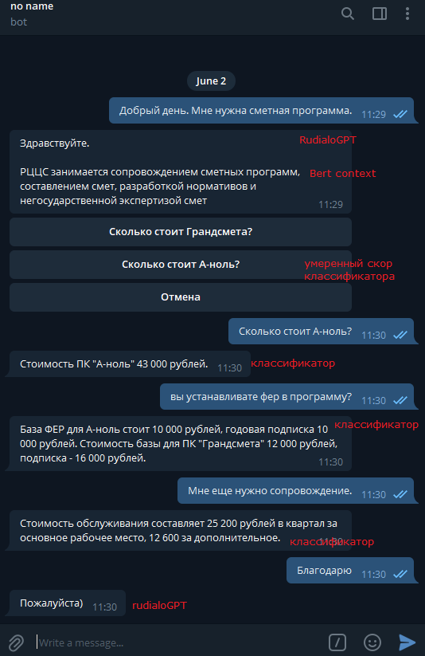
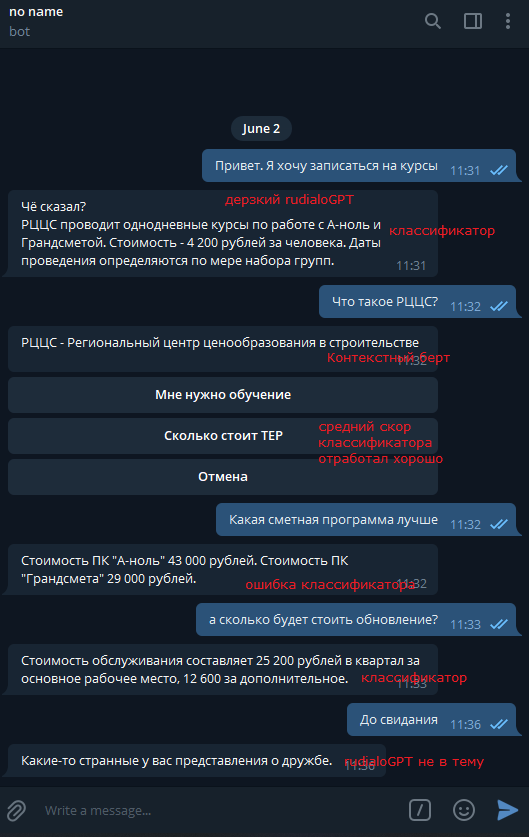
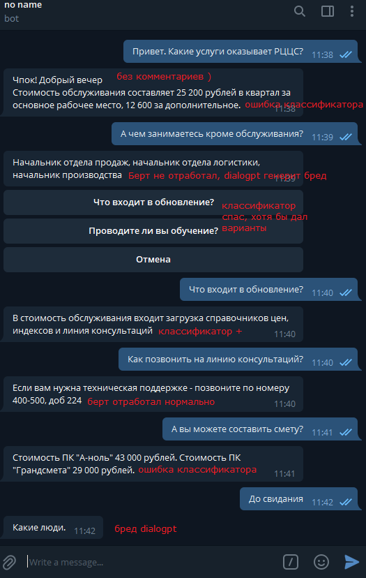
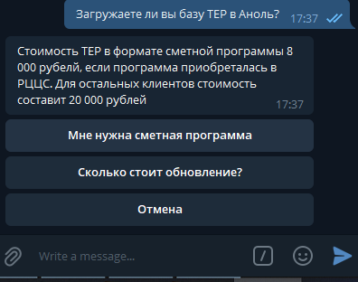

# Итоговый проект по курсу "Введение в обработку естественного языка". Telegram чат-бот @rccs51bot
## Задача.
#### Создание интерактивного чат-бота, который мог бы оказать первичную консультацию по услугам компании и сориентировать клиента в ценах. Сфера дейтельности компании - продажа и сопровождение сметного ПО, а так же разработки сметных нормативов, плюс еще немного по мелочам. 

## Особенности.
#### Отсутствие возможности собрать адекватный датасет онлайн-консультирования клиентов. Диалоги велись только устно и не документировались.
## Примеры. От удачного к бредовым.
|Хороший|Средний|Плохой|
|---|---|---|
|  |  | |

## Описание работы бота.
Основной библиотекой для обработки сообщений пользователя является **Transformers**. Сообщение последовательно передается через ряд моделей до тех пор, пока не обнаружит приемлемый для себя результата.
#### 0. Предобработка сообщений:
Мини-словарь профессиональных терминов и аббревиатур. Заменяем подобные сущности на "человеческий" язык, чтобы моделям было проще понимать о чем идет речь.
#### 1. Многоклассовая классификация вопроса по базе вопросов и ответов.
Имеется база типовых вопросов по услугам компании в разничной формулировке (всего ~250 вопросов). Для этих вопрсов есть 12 классов ответов.
Вопрос пользователя представлен в виде BERT Embedding (Geotrend/bert-base-ru-cased), после чего полносвязная нейронная сеть проводит классификацию данного вопроса и выбирать наилучший результат из базы. Если степень уверенности в ответе превышает заданный порог (qa_threshold_top), бот отвечает пользователю.
В случае, если уверенность ответа всё еще высокая (qa_threshold_bottom), то пользователю выдаются переформулированные варианты его вопроса в виде Inline кнопок.

Если пользователь удовлетворен ответом, он может нажать "Отмена", либо выбрать подходящий вариант. Пока что варианты ответа предопределены вручную, но в целом это можно рассматривать как задачу из рекомендательных систем. 
#### 2. Поиск ответа по контексту SQUAD.
Если ответ из вопросно-ответной системы имеет плохой результат (вероятность ниже qa_threshold_bottom), то вопрос передается в БЕРТ модель поиска ответа из контекста. В качестве контекста выступает небольшая статья, которая описывает организацию, сферу её дейтельности и общее описание товаров и услуг.
    
Идея пока сработала плохо. Попробовал несколько моделек с поддержкой русского языка, но результаты очень непредсказуемы. Rubert от deeppavlov показывал лучшие результаты, но у него совсем другие требования к библиотекам и в рамках одного ноутбука совместить проблематично. Score модели так же очень странный, правильные ответы могут иметь низкий результат и наоборот - не понятно как определять порог. Обязательно нужно дообучать такую модель на своих данных, которых толком нет

#### 3. Передача сообщения в RuDialoGPT.
Если модели 1 и 2 не выдали нормального результата, то скорее всего пользователь задал какой-то общий вопрос или, например, поздоровался. Имеем ввиду, что используемая модель обучалась в том числе на неформальных и даже грубых комментах, так что может ответить грубостью на грубость.
    
Опять таки проблемы: для обучения под свои задачи нужны большие данные, именно свои - а их нет. Второе - для использования генераторов в качестве консультантов нужна постобработка и построение графа диалого (что за рамками нашего курса и точного понимания процесса у меня нет). По ссылке достаточно интересное видео по обучению такой модели от МТС https://www.youtube.com/watch?v=Sru_UDGq1pE&t=1110s , но, наверное, пока это не мой уровень :) 

#### 4. Логгирование диалогов.
Добавлена функция chat_log(), чтобы была возможность сохранять и просматривать диалоги бота. Сбор данных в этом случае - самая важная часть, которой не хватает.
    
## Вывод
#### При отсутствии большого количества правильных данных нет особого смысла пытаться использовать большие сложные модели - их просто не получится дотюнить должным образом. К тому же, наверное подобными вопросами занимаются всё-таки уже состоявшиеся профессионалы в данной области.
#### Простой путь - предопределенные ответы и поиск схожих вопросов. Так мы точно избегаем неожиданных ответов и контролируем диалог, хотя и ограничиваем его разнообразние.
#### Посмотрев на чат боты от некоторых компаний в мобильных приложениях (ТЕЛЕ-2, Сбер и т.д.) я пока не увидел подобия человеческого общения, они достаточно заскриптованы.